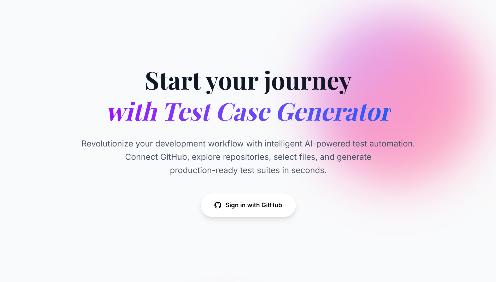

# 🧪 AI Test Case Generator for GitHub

[](https://reactjs.org/)
[](https://www.typescriptlang.org/)
[](https://nodejs.org/)
[](https://expressjs.com/)
[](https://tailwindcss.com/)
[](https://docs.github.com/en/rest)
[](https://www.prisma.io/)
[](https://ai.google/)

> **Transform your development workflow with AI-powered test generation directly from your GitHub repositories**

An intelligent platform that automatically generates comprehensive test cases for your codebase using advanced AI. Simply connect your GitHub account, select your files, and get production-ready test suites in minutes.

## ✨ Key Features

- **🔐 Seamless GitHub Integration:** Secure OAuth login, access to all your repositories, and real-time sync with your latest code
- **📁 Smart File Selection:** Interactive explorer with tree/list view, multi-file selection, and intelligent file type detection
- **🤖 Advanced AI Analysis:** Context-aware test planning, edge case detection, and framework-agnostic output using Google Gemini AI
- **📝 Professional Code Editor:** Syntax highlighting with Toast UI Editor, dark/light theme toggle, copy functionality, and markdown support
- **⚡ Real-time Processing:** Session-based file processing with loading states and error handling
- **📱 Responsive Design:** Modern glassmorphism UI with Tailwind CSS, mobile-first design, and smooth animations

## 🏗️ Project Architecture

### Frontend Structure
```
frontend/
├── src/
│   ├── components/          # Reusable UI components
│   │   ├── CodeEditor.tsx   # Toast UI Editor wrapper
│   │   ├── Header.tsx       # Navigation header with back button
│   │   ├── LoadingIndicator.tsx
│   │   ├── SummaryBox.tsx   # AI summary display component
│   │   └── ThemeToggle.tsx  # Dark/light theme switcher
│   ├── contexts/            # React contexts
│   │   ├── AppStateContext.tsx  # Global app state management
│   │   └── AuthContext.tsx      # User authentication state
│   ├── pages/               # Application pages/routes
│   │   ├── LandingPage.tsx  # Welcome page with GitHub OAuth
│   │   ├── HomePage.tsx     # Repository dashboard
│   │   ├── RepoFilesPage.tsx # File explorer with multi-select
│   │   ├── SummaryPage.tsx  # AI-generated test summaries
│   │   └── EditorPage.tsx   # Generated test code viewer
│   ├── api.ts              # Axios API client configuration
│   ├── App.tsx             # Main application component with routing
│   └── main.tsx            # Application entry point
├── public/
├── tailwind.config.js      # Tailwind CSS configuration
├── vite.config.ts          # Vite build configuration
└── package.json            # Dependencies and scripts
```

### Backend Structure
```
backend/
├── src/
│   ├── controllers/         # API route handlers
│   │   ├── githubController.ts     # GitHub OAuth and API integration
│   │   ├── getFileContent.ts       # Repository file content retrieval
│   │   ├── generateAIsummary.ts    # AI test summary generation
│   │   ├── generateTestCode.ts     # AI test code generation
│   │   └── getUserDetails.ts       # User profile management
│   ├── middleware/          # Express middleware
│   │   └── authMiddleware.ts       # JWT token validation
│   ├── utils/              # Utility functions
│   │   └── generateTestcases.ts    # Google Gemini AI integration
│   └── index.ts            # Express server setup and routes
├── prisma/
│   ├── schema.prisma       # Database schema definition
│   └── migrations/         # Database migration files
└── package.json           # Dependencies and scripts
```

### Technology Stack
- **Frontend:** React 18, TypeScript, Vite, Tailwind CSS, React Router DOM, Toast UI Editor, Axios
- **Backend:** Node.js, Express, TypeScript, Prisma ORM, JWT authentication, Cookie Parser, CORS
- **Database:** PostgreSQL/SQLite (managed via Prisma)
- **AI Integration:** Google Gemini AI for test generation
- **Authentication:** GitHub OAuth 2.0 with secure cookie-based sessions
- **Styling:** Tailwind CSS with glassmorphism design, custom gradients, and responsive breakpoints

## 🚀 Quick Start

### Prerequisites
- Node.js 18.0+ and npm/yarn
- GitHub OAuth App (Client ID & Secret)
- Google AI API key for Gemini
- Database (PostgreSQL recommended)

### Installation

1. **Clone the repository**
```bash
git clone https://github.com/yourusername/github_testcase_generator.git
cd github_testcase_generator
```

2. **Install dependencies**
```bash
# Backend
cd backend
npm install

# Frontend
cd ../frontend
npm install
```

3. **Environment Configuration**

Backend `.env`:
```env
DATABASE_URL="your-database-connection-string"
GITHUB_CLIENT_ID="your-github-oauth-client-id"
GITHUB_CLIENT_SECRET="your-github-oauth-client-secret"
JWT_SECRET="your-jwt-secret-key"
GOOGLE_AI_API_KEY="your-google-ai-api-key"
```

Frontend `.env`:
```env
VITE_BACKEND_URL="http://localhost:3000"
```

4. **Database Setup**
```bash
cd backend
npx prisma migrate dev
npx prisma generate
```

5. **Start Development Servers**
```bash
# Backend (port 3000)
cd backend
npm run dev

# Frontend (port 5173)
cd frontend
npm run dev
```

## 📱 Complete Application Flow

### 1. Landing Page
The entry point showcasing the platform's value proposition with elegant glassmorphism design.

**Features:**
- Hero section with animated gradients
- Feature highlights with hover effects
- Step-by-step process visualization
- Secure GitHub OAuth integration button
- Responsive design for all devices




---

### 2. GitHub Authentication Flow
Secure OAuth 2.0 integration for seamless GitHub account connection.

**Process:**
- Redirect to GitHub OAuth consent screen
- User grants repository access permissions
- JWT token generation and secure cookie storage
- Automatic redirection to dashboard


---

### 3. Home Page (Repository Dashboard)
Comprehensive dashboard displaying all user repositories with advanced filtering.

**Features:**
- Responsive grid layout with repository cards
- Repository metadata (stars, language, privacy status, last update)
- Real-time repository synchronization
- Error handling for authentication issues
- Direct links to repository exploration


---

### 4. Repository Files Explorer
Advanced file browser with intelligent filtering and multi-selection capabilities.

**Features:**
- **Dual View Modes:** Tree structure and list view
- **Smart Filtering:** Only shows code files with language detection
- **File Type Icons:** Visual indicators for different programming languages
- **Multi-Selection:** Checkbox-based selection with real-time count
- **Folder Navigation:** Expandable/collapsible folder structure
- **Selection Persistence:** Maintains selections across view mode changes


---

### 5. AI Test Summaries Generation
Intelligent analysis of selected files with comprehensive test planning.

**Features:**
- **AI-Powered Analysis:** Context-aware understanding of code functionality
- **Comprehensive Coverage:** Edge cases, error handling, integration scenarios
- **Interactive Editing:** Toast UI Editor with markdown support
- **Theme Toggle:** Dark/light mode for comfortable viewing
- **Per-File Processing:** Individual summaries for each selected file
- **Real-time Generation:** Progress indicators and loading states


---

### 6. Test Code Generation & Editor
Production-ready test code generation with professional editing capabilities.

**Features:**
- **Framework Detection:** Automatic selection of appropriate testing framework
- **Complete Test Suites:** Imports, setup, teardown, and comprehensive test cases
- **Syntax Highlighting:** Professional code editor with language support
- **Copy Functionality:** One-click code copying with success feedback
- **Responsive Design:** Optimal viewing on all device sizes
- **Navigation:** Seamless flow between summaries and generated code


---

## 🔧 API Endpoints & AI Integration

### Authentication Endpoints
```typescript
GET  /github/login          # Initiate GitHub OAuth flow
GET  /github/callback       # Handle OAuth callback
GET  /auth/user          # Get authenticated user info
```

### Repository Management
```typescript
GET  /github/repos          # Fetch user repositories
GET  /repos/files           # Get repository file structure  
GET  /repos/file-content    # Retrieve specific file content
```

### AI-Powered Generation
```typescript
POST /generate-test-summaries  # Generate AI test summaries
POST /generate-test-code       # Generate executable test code
```

### AI Integration Details
- **Model:** Google Gemini AI for advanced code understanding
- **Capabilities:** Multi-language support, framework detection, comprehensive test generation
- **Security:** Session-based processing, no permanent code storage
- **Optimization:** Context-aware prompts for accurate test case generation

## 🛠️ Development Tools & Configuration

### Frontend Configuration
- **Vite:** Fast build tool with HMR support
- **TypeScript:** Strict type checking and modern JS features
- **ESLint:** Code quality and consistency enforcement
- **Tailwind CSS:** Utility-first CSS with custom configurations
- **React Router:** Client-side routing with protected routes

### Backend Configuration
- **Express:** RESTful API with middleware support
- **Prisma:** Type-safe database access with migration support
- **JWT:** Secure authentication with HTTP-only cookies
- **CORS:** Configured for secure cross-origin requests
- **Environment Variables:** Secure configuration management

## 🔐 Security & Privacy

### Authentication Security
- **OAuth 2.0:** Industry-standard GitHub authentication
- **JWT Tokens:** Secure, stateless authentication
- **HTTP-Only Cookies:** XSS protection for token storage
- **CORS Configuration:** Restricted cross-origin access

### Data Privacy
- **Session-Based Processing:** No permanent code storage
- **Minimal Permissions:** Read-only GitHub repository access
- **Secure Transmission:** HTTPS for all API communications
- **No User Data Retention:** Code content processed temporarily only

### Best Practices
- **Input Validation:** Comprehensive request validation
- **Error Handling:** Secure error messages without data exposure
- **Rate Limiting:** API usage protection (can be implemented)
- **Dependency Updates:** Regular security patches and updates

## 📚 Usage Scenarios

### Individual Developers
- Generate tests for personal projects
- Learn testing best practices through AI suggestions
- Improve code coverage quickly

### Development Teams
- Standardize testing approaches across projects
- Accelerate sprint deliveries with automated test generation
- Maintain consistent code quality

### Code Review Process
- Generate comprehensive tests before PR submissions
- Validate edge cases and error handling
- Ensure proper test coverage for new features

## 🙏 Acknowledgments

- **Google AI (Gemini):** Advanced AI model for code understanding
- **GitHub API:** Comprehensive repository and authentication services
- **Toast UI Editor:** Professional markdown editing experience
- **Tailwind CSS:** Beautiful and responsive design system
- **React Community:** Excellent ecosystem and documentation
- **Open Source Contributors:** Various libraries and tools used

---

<div align="center">

**🚀 Ready to revolutionize your testing workflow?**


*Built with ❤️ for developers who value quality and efficiency*

---

</div>